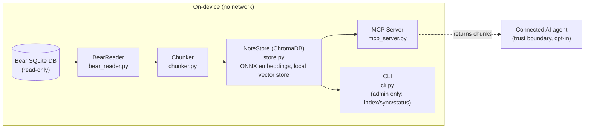

# bear-app-rag

Local-first semantic search for [Bear](https://bear.app) notes. Indexes your notes with local ONNX embeddings, proves it works with a hand-rolled eval, and serves results to AI agents via MCP.

2 direct dependencies. Zero frameworks. [Provable benchmarks](#benchmark-results).

## Why This Exists

Bear has no API. Your notes are locked in a SQLite database. Existing Bear integrations pass entire notes to AI, which breaks past ~50 notes. bear-app-rag chunks your notes, embeds them locally, and retrieves the most relevant chunks via semantic search.

**The key claim:** RAG retrieval beats keyword matching by 40% on paraphrase queries. [See the benchmark results.](#benchmark-results)

## Quickstart (5 minutes)

**Prerequisites:** macOS, Python 3.11+, [Bear](https://bear.app) installed with some notes. The `pip` quickstart below needs nothing more; for local development, the MCP server, or the cron auto-sync you'll also want [uv](https://astral.sh/uv).

```shell
pip install git+https://github.com/fairbearlab/bear-app-rag.git
bear-rag index
```

First index takes ~30s extra to download the embedding model (~90MB, one-time). Subsequent runs are instant.

### MCP Server

The MCP server is the primary interface: it lets an AI agent like Claude Code search your notes directly during a conversation, instead of you running CLI commands by hand. Add to `.mcp.json`:

```json
{
  "mcpServers": {
    "bear-notes": {
      "command": "uv",
      "args": ["--directory", "/path/to/bear-app-rag", "run", "bear-rag-mcp"]
    }
  }
}
```

Claude Code can then search your notes during conversation.

The same stdio server should work with any MCP-compatible host (for example Codex CLI, GitHub Copilot's agent mode, or the Claude desktop app) — point that host's MCP config at the same `bear-rag-mcp` command shown above. Only the Claude Code config above is tested; treat the others as starting points.

### Auto-sync with cron

```shell
*/15 * * * * cd /path/to/bear-app-rag && uv run bear-rag sync --quiet >> ~/.bear-rag/sync.log 2>&1
```

## How It Works



The installed package has zero cloud dependency, and the index/search/sync path never egresses: your notes are read, chunked, and embedded on-device via ONNX Runtime, and the only network call on that path is the one-time model download. There is one documented, opt-in boundary: the MCP server hands retrieved chunks to whatever agent is connected (that agent, not this codebase, generates the answer). Dev tooling has a second, separate opt-in caller — the LLM-judge eval harness — that never ships with the package (see [Development](#development)). See [ADR-0002](docs/decisions/0002-local-onnx-embeddings.md) for the full privacy audit.

[Read the full architecture tour.](docs/ARCHITECTURE.md)

## Benchmark Results

RAG vs keyword (SQLite LIKE) retrieval on a 25-note synthetic corpus with 20 eval queries across four query types. Results from `tests/eval/results.json`.

Four metrics, all higher = better: **Recall@5** is the fraction of expected notes that appear in the top 5 results; **MRR** captures how high the first correct note ranks (1.0 = always first); **Groundedness** is the fraction of expected keywords present in the retrieved text; **LLM-Judge Groundedness** is Claude scoring (0.0–1.0) how well the retrieved text actually supports answering the query, run on both retrieval paths. Full definitions are in [EVALUATION.md](docs/EVALUATION.md).

### Aggregate Metrics

| Metric | RAG | Keyword (LIKE) |
|--------|-----|----------------|
| Recall@5 | 0.92 | 0.76 |
| MRR | 0.90 | 0.76 |
| Groundedness | 0.86 | 0.80 |
| LLM-Judge Groundedness | 0.71 | 0.65 |

The keyword-overlap and LLM-judge groundedness metrics agree: RAG retrieves text that better supports the answer (judge 0.71 vs 0.65 overall), with the gap widest on the paraphrase queries it targets (0.72 vs 0.55).

### By Query Type

| Query Type | Count | Recall RAG | Recall LIKE | MRR RAG | MRR LIKE |
|------------|-------|------------|-------------|---------|----------|
| exact\_match | 5 | 1.00 | 1.00 | 1.00 | 1.00 |
| multi\_concept | 5 | 0.83 | 0.73 | 0.84 | 0.90 |
| paraphrase | 5 | 1.00 | 0.60 | 0.77 | 0.44 |
| synonym | 5 | 0.83 | 0.70 | 1.00 | 0.70 |

RAG wins on paraphrase (+40% recall, +33% MRR) and synonym (+13% recall, +30% MRR) queries. On exact-match queries (the control group), both methods tie at 1.00, confirming the baseline is fair. The honest exception is multi_concept: RAG retrieves more of the expected notes (recall 0.83 vs 0.73) but the keyword baseline ranks its first hit higher (MRR 0.90 vs 0.84). That gap is driven by a single query ("weekend projects combining outdoor activity with food"), where RAG's first relevant hit lands at rank 5 and LIKE's at rank 2; the other four multi_concept queries tie at MRR 1.00. RAG does not win on every query type, and the table is the honest picture.

### Side-by-Side Examples

**Query:** "What makes products easy to use without reading instructions?"

- **RAG returns:** Design of Everyday Things, Recipe Ingredient Tracker, Road Trip Planning
- **Keyword returns:** Atomic Habits, Code Review Checklist, Budget Backpacking
- *RAG found the Design of Everyday Things note (affordances, signifiers); keyword missed it because "instructions" and "easy to use" don't appear verbatim.*

**Query:** "How should I write software interfaces that other developers will enjoy using?"

- **RAG returns:** Pragmatic Programmer, Deploying Python Apps, API Design Best Practices
- **Keyword returns:** Design of Everyday Things, Atomic Habits, Thai Green Curry
- *RAG placed the API Design note in the top results; keyword missed it because "interfaces" appears in unrelated contexts.*

[View benchmark visualization](docs/benchmarks/) | [Eval methodology](docs/EVALUATION.md)

## Design Decisions

Key architectural choices, documented as [ADRs](docs/decisions/):

- **[No LangChain](docs/decisions/0001-no-langchain.md)** -- 2 direct deps, not 50+ transitive
- **[Local ONNX Embeddings](docs/decisions/0002-local-onnx-embeddings.md)** -- No note data leaves the machine
- **[Markdown-Aware Chunking](docs/decisions/0003-chunk-sizing-strategy.md)** -- Split on headings, not character count
- **[MCP as Primary Interface](docs/decisions/0004-mcp-as-primary-interface.md)** -- AI agents are the primary users
- **[Incremental Sync](docs/decisions/0005-incremental-sync-via-timestamps.md)** -- Core Data timestamps for change detection
- **[Hand-Rolled Eval](docs/decisions/0006-hand-rolled-eval-framework.md)** -- pytest + JSON fixtures, no eval framework
- **[MIT License](docs/decisions/0007-mit-license.md)** -- Maximum adoption

[Read the full story: Building a Production RAG Pipeline Without LangChain](docs/BUILDING.md)

## CLI Reference

```shell
bear-rag index              # Full rebuild -- wipe and re-index all notes
bear-rag sync               # Incremental update since last sync
bear-rag sync --dry-run     # Preview what would change
bear-rag status             # Show index stats and last sync time
bear-rag demo               # Self-contained benchmark demo (no Bear DB required)
```

## Project Structure

| Module | Purpose |
|--------|---------|
| `bear_reader.py` | Reads notes and tags from Bear's SQLite database |
| `chunker.py` | Markdown-aware splitting at headings with overlap |
| `store.py` | ChromaDB collection management with ONNX embeddings |
| `sync.py` | Incremental sync with timestamp-based change detection |
| `cli.py` | argparse entry point with subcommands |
| `mcp_server.py` | MCP server exposing 6 tools: search, read, list, tags, sync, status |
| `demo.py` | Self-contained benchmark demo with inline corpus |
| `config.py` | Constants, embedding model pin, telemetry disable |

## Configuration

All constants live in `bear_rag/config.py`:

| Constant | Default | Description |
|----------|---------|-------------|
| `BEAR_DB_PATH` | `~/Library/Group Containers/.../database.sqlite` | Bear SQLite database path |
| `DATA_DIR` | `~/.bear-rag` | Persistent state directory |
| `CHROMA_DIR` | `~/.bear-rag/chroma` | ChromaDB storage |
| `EMBEDDING_MODEL` | `all-MiniLM-L6-v2` | Pinned embedding model |
| `MAX_CHUNK_WORDS` | 300 | Target max words per chunk (~390 tokens) |
| `MIN_CHUNK_WORDS` | 30 | Below this, merge into adjacent chunk |
| `OVERLAP_WORDS` | 40 | Word overlap when splitting oversized chunks |

## Development

```shell
git clone https://github.com/fairbearlab/bear-app-rag.git
cd bear-app-rag
uv sync --all-extras       # Install with dev dependencies
uv run bear-rag index      # Build the index
uv run pytest -v           # Run tests (139 unit tests)
uv run pytest -m eval -v   # Run eval suite (27 eval tests)
uv run bear-rag demo       # Run self-contained benchmark demo
```

With the optional LLM judge (requires `ANTHROPIC_API_KEY`):

```shell
EVAL_LLM_JUDGE=1 uv run pytest -m eval -v
```

Regenerate all presentation artifacts:

```shell
bash scripts/showcase.sh
```

## License

[MIT](LICENSE)
