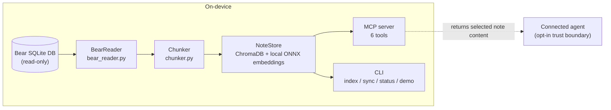

# bear-app-rag

Local-first semantic search for [Bear](https://bear.app) notes. It reads Bear's SQLite database without modifying it, builds a local ONNX vector index, and let’s agents retrieve through MCP.

Minimal by design. Two production dependencies. No orchestration framework. An eval shows where semantic search beats keyword matching and where it does not.

## Why this exists

I keep enough material in Bear that remembering the idea is easier than remembering the words I used. Bear has no public API, and keyword search cannot connect a query such as "software releases without downtime" with a note about blue-green deployments unless the wording happens to overlap.

Sending an entire vault to a model is not a retrieval strategy. This project reads the local database, splits notes along their Markdown structure, embeds the chunks on-device, and returns only the relevant excerpts.

On the committed synthetic eval, semantic retrieval improves paraphrase recall from 0.60 to 1.00. The control group ties at 1.00, and the multi-concept group is a useful reminder that vector search does not win every ranking contest.

Honestly this served as a learning project for me and Shiny Frog has since released a first-party MCP that will likely serve you better long-term.

## Quickstart

Prerequisites: macOS, Python 3.11+, and [Bear](https://bear.app) with at least one note.

```shell
pip install git+https://github.com/fairbearlab/bear-app-rag.git
bear-rag index
```

The first index downloads the roughly 90 MB embedding model. Later indexing and search can run offline.

### MCP server

The MCP server is the main interface. It lets a connected agent search, browse, read, and sync notes during a conversation. For a source checkout, add this to `.mcp.json`:

```json
{
  "mcpServers": {
    "bear-notes": {
      "command": "uv",
      "args": ["--directory", "/path/to/bear-app-rag", "run", "bear-rag-mcp"]
    }
  }
}
```

This configuration is tested with Claude Code. Other MCP hosts can use the same stdio command, but their configuration shape may differ.

### Auto-sync with cron

```shell
*/15 * * * * cd /path/to/bear-app-rag && uv run bear-rag sync --quiet >> ~/.bear-rag/sync.log 2>&1
```

## How it works



The installed package has no cloud SDK. Indexing, sync, and search do not initiate network requests after the one-time model download. ChromaDB telemetry is disabled through both its runtime settings and an import-time environment default.

That boundary ends where the MCP handoff begins: an agent receives your note content and may use its own network services. The optional development-only LLM judge also calls Anthropic when explicitly enabled. Those are opt-in boundaries, not properties of the indexing path. [ADR-0002](docs/decisions/0002-local-onnx-embeddings.md) records the full scope.

[Read the architecture tour.](docs/ARCHITECTURE.md)

## Benchmark results

The committed eval compares local semantic retrieval with a SQLite `LIKE` baseline on 25 synthetic notes and 23 queries. Twenty queries cover exact match, synonym, paraphrase, and multi-concept retrieval. Three more exercise tag-filter correctness end to end.

Results come from `tests/eval/results.json`. All three reported metrics are deterministic and higher is better:

- **Recall@5:** fraction of expected notes present in the top five results.
- **MRR:** reciprocal rank of the first expected result.
- **Groundedness:** fraction of expected keywords present in retrieved text.

| Metric | Semantic | Keyword (`LIKE`) |
|--------|----------|------------------|
| Recall@5 | 0.90 | 0.75 |
| MRR | 0.91 | 0.79 |
| Groundedness | 0.87 | 0.80 |

### By query type

| Query type | Count | Recall semantic | Recall `LIKE` | MRR semantic | MRR `LIKE` |
|------------|-------|-----------------|---------------|--------------|------------|
| `exact_match` | 5 | 1.00 | 1.00 | 1.00 | 1.00 |
| `multi_concept` | 5 | 0.83 | 0.73 | 0.84 | 0.90 |
| `paraphrase` | 5 | 1.00 | 0.60 | 0.77 | 0.44 |
| `synonym` | 5 | 0.83 | 0.70 | 1.00 | 0.70 |
| `tag_multi_or` | 1 | 1.00 | 0.67 | 1.00 | 1.00 |
| `tag_no_match` | 1 | 1.00 | 1.00 | 1.00 | 1.00 |
| `tag_single` | 1 | 0.33 | 0.33 | 1.00 | 1.00 |

The core result: semantic retrieval is much better when the query paraphrases the note, but no better when the exact words are already present. On multi-concept queries, semantic retrieval finds more expected notes but ranks its first relevant result slightly lower. That is a tradeoff worth reporting, not rounding away.

### Side-by-side examples

**Query:** "What makes products easy to use without reading instructions?"

- **Semantic returns:** Recipe Ingredient Tracker, The Design of Everyday Things, Road Trip Planning
- **Keyword returns:** Atomic Habits, Code Review Checklist, Budget Backpacking
- The relevant note discusses affordances and signifiers. Keyword search cannot recover a concept whose query vocabulary never appears in the note.

**Query:** "How should I write software interfaces that other developers will enjoy using?"

- **Semantic returns:** The Pragmatic Programmer, Deploying Python Apps, API Design Best Practices
- **Keyword returns:** The Design of Everyday Things, Atomic Habits, Thai Green Curry
- Semantic search places the API design note in the results; keyword search finds unrelated uses of "design" and "interfaces."

[View the benchmark visualization](docs/benchmarks/) or read the [evaluation methodology](docs/EVALUATION.md).

## Design decisions

The [ADRs](docs/decisions/) record the choices and their limits:

- [No LangChain](docs/decisions/0001-no-langchain.md): direct calls fit this pipeline.
- [Local ONNX embeddings](docs/decisions/0002-local-onnx-embeddings.md): note content stays local during retrieval.
- [Markdown-aware chunking](docs/decisions/0003-chunk-sizing-strategy.md): headings are better boundaries than character counts.
- [MCP as the primary interface](docs/decisions/0004-mcp-as-primary-interface.md): the CLI handles administration; MCP handles retrieval.
- [Incremental sync](docs/decisions/0005-incremental-sync-via-timestamps.md): timestamps find changes; reconciliation removes stale notes.
- [Hand-rolled eval](docs/decisions/0006-hand-rolled-eval-framework.md): pytest and JSON are enough for this benchmark.
- [MIT license](docs/decisions/0007-mit-license.md): permissive distribution.
- [Embedding-model evaluation](docs/decisions/0008-embedding-model-evaluation.md): keep MiniLM until stronger evidence justifies the cost of switching.

[Read the longer engineering narrative.](docs/BUILDING.md)

## CLI reference

```shell
bear-rag index              # Wipe and rebuild the index
bear-rag sync               # Incremental update from Bear
bear-rag sync --dry-run     # Preview updates and deletions
bear-rag sync --quiet       # Print only when something changed
bear-rag status             # Show index statistics and last sync time
bear-rag demo               # Run a self-contained demo without Bear
```

## Project structure

| Module | Purpose |
|--------|---------|
| `bear_reader.py` | Read notes, tags, and live note state from Bear's SQLite database |
| `chunker.py` | Split Markdown along headings with bounded overlap |
| `store.py` | Persist and query ONNX embeddings through ChromaDB |
| `sync.py` | Update changed notes and reconcile stale indexed notes |
| `mcp_server.py` | Expose search, read, browse, sync, and status tools |
| `cli.py` | Provide index, sync, status, and demo commands |
| `status.py` | Read shared index and sync-state statistics |
| `demo.py` | Run the small, self-contained retrieval demonstration |
| `config.py` | Define paths, chunk settings, model choice, and telemetry defaults |
| `models.py` | Define notes, chunks, metadata, and sync results |

## Configuration

The defaults live in `bear_rag/config.py`:

| Constant | Default | Purpose |
|----------|---------|---------|
| `BEAR_DB_PATH` | Bear's group-container SQLite path | Read-only source database |
| `DATA_DIR` | `~/.bear-rag` | Local state directory |
| `CHROMA_DIR` | `~/.bear-rag/chroma` | Vector index storage |
| `EMBEDDING_MODEL` | `all-MiniLM-L6-v2` | Documented production model |
| `MAX_CHUNK_WORDS` | `300` | Maximum target chunk size |
| `MIN_CHUNK_WORDS` | `30` | Merge threshold for small sections |
| `OVERLAP_WORDS` | `40` | Context repeated across oversized splits |

## Development

```shell
git clone https://github.com/fairbearlab/bear-app-rag.git
cd bear-app-rag
uv sync --extra dev
uv run pytest -v
uv run pytest -m eval -v
uv run bear-rag demo
```

The optional LLM judge requires `ANTHROPIC_API_KEY` and an explicit flag:

```shell
EVAL_LLM_JUDGE=1 uv run pytest -m eval -v
```

The alternate-model research harness has a separate extra:

```shell
uv sync --extra research
uv run python tests/eval/embedding_sweep.py --list
```

## License

[MIT](LICENSE)
