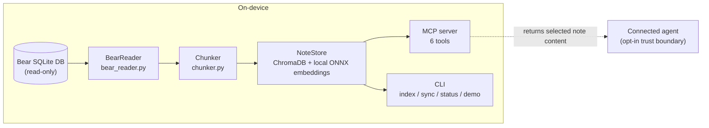

# Architecture

## Pipeline



The installed package has two production dependencies: `chromadb` and `mcp`. `anthropic` belongs to the development extra and is used only by the optional eval judge.

## Reading Bear

Bear stores notes in a Core Data SQLite database at:

```text
~/Library/Group Containers/9K33E3U3T4.net.shinyfrog.bear/Application Data/database.sqlite
```

`BearReader` opens that file through a SQLite URI with `mode=ro`. The application never writes to Bear's database.

Core Data timestamps count seconds from 2001-01-01 UTC rather than the Unix epoch. `_core_data_to_datetime` and `_datetime_to_core_data` isolate that conversion so the rest of the package works with timezone-aware UTC datetimes.

Tags live in `ZSFNOTETAG` behind the `Z_5TAGS` join table. Batch tag reads use groups of 900 primary keys to stay below SQLite's common 999-variable limit. The reader also exposes two narrower views needed by sync and search:

- `read_active_pks()` returns every non-trashed, non-archived note currently in Bear.
- `note_pks_for_tags()` returns the uncapped active-note set matching any supplied tag.

Browse and search exclude archived notes. `read_note_by_title()` is the deliberate exception: a direct title lookup can return an archived note and reports `is_archived` so the caller can treat it accordingly.

## Chunking

`chunk_note()` splits Bear's Markdown on ATX headings while ignoring heading-like text inside fenced code blocks. The author-provided hierarchy is the first boundary; fixed-size splitting is only a fallback for an oversized section.

Three settings control the result:

- `MAX_CHUNK_WORDS = 300`: split sections that exceed the target.
- `MIN_CHUNK_WORDS = 30`: merge small fragments into an adjacent section.
- `OVERLAP_WORDS = 40`: repeat context across splits of an oversized section.

Each chunk stores its note primary key, title, tags, index, modification time, source, and heading path. A path such as `# Recipe > ## Ingredients` gives the caller useful context without retrieving the whole note.

[ADR-0003](decisions/0003-chunk-sizing-strategy.md) records the tradeoffs behind these values.

## Embeddings and storage

`NoteStore` wraps ChromaDB's `PersistentClient` and explicitly constructs `DefaultEmbeddingFunction()`, which uses all-MiniLM-L6-v2 through ONNX Runtime. The model produces 384-dimensional vectors and is downloaded once on first use.

The collection lives at `~/.bear-rag/chroma/` by default. `NoteStore` provides a small surface:

- write chunks in batches of 100;
- delete every chunk for a note;
- reset the collection for a full index;
- run vector queries with an optional native ChromaDB metadata filter;
- report indexed note primary keys and collection statistics.

Tag logic does not live in the store. The MCP layer resolves tags to note primary keys and passes `{"note_pk": {"$in": [...]}}` to ChromaDB. Keeping the store reader-free avoids a second query engine and makes the boundary testable.

`get_stats()` computes its distinct note count from stored metadata. That is an O(all chunks) scan and is acceptable for the low-frequency status command. If status becomes a hot path, the count needs a different storage strategy rather than a nicer comment.

## Network boundary

Indexing, embedding, sync, and search do not initiate network requests after the embedding model has been downloaded. ChromaDB telemetry is disabled in two places:

1. `config.py` sets `ANONYMIZED_TELEMETRY=False` before ChromaDB is imported.
2. `NoteStore` passes `Settings(anonymized_telemetry=False)` to `PersistentClient`.

`tests/test_privacy.py` pre-warms the model cache, blocks outbound sockets, and exercises store construction, upsert, query, and sync. A negative control confirms the socket block is active.

The MCP server is an explicit trust boundary. It runs over local stdio, but it returns note content to the connected process; that process may send the content elsewhere. The optional eval judge is another explicit boundary and calls Anthropic only when `EVAL_LLM_JUDGE=1` is set. [ADR-0002](decisions/0002-local-onnx-embeddings.md) defines the claim in durable form.

## MCP server

The stdio server exposes six tools:

| Tool | Purpose |
|------|---------|
| `search_notes` | Return semantically ranked chunks, optionally restricted by tags |
| `read_note` | Read a full note by case-insensitive title |
| `list_notes` | Browse active notes by tag, date, title, and limit |
| `list_tags` | Count tags across active notes |
| `sync_notes` | Update the index from Bear |
| `status` | Report note count, chunk count, and last sync time |

All tool functions use the same error boundary. Expected input and missing-database errors return stable messages; raw paths and unexpected exception text remain in server logs.

### Tag-filter snapshot semantics

`search_notes(query, tags=[...])` resolves tag membership from live Bear SQL and retrieves chunk content from the indexed snapshot. A tag edit can therefore change which notes match before the returned chunk metadata reflects the edit. The next sync closes the gap.

If no note matches the requested tags, the tool returns `[]` before calling ChromaDB. An empty `$in` list is not passed through because ChromaDB can treat it as no filter and return unrestricted results.

[ADR-0004](decisions/0004-mcp-as-primary-interface.md) explains why MCP owns this boundary.

## Sync

Incremental sync combines timestamp-based updates with set reconciliation:

1. Read the last Core Data timestamp from `~/.bear-rag/last_sync.json`.
2. Read non-trashed notes modified after that timestamp, including archived notes so the cursor can advance past an archive-only edit.
3. Re-chunk and upsert modified notes that are still active.
4. Compare indexed primary keys with `read_active_pks()` and delete anything stale. This catches archived, trashed, and deleted notes without assuming those actions update `ZMODIFICATIONDATE`.
5. Advance the cursor to the latest modified row and persist the index schema version.

Running sync twice without a Bear change reports zero updates and zero deletions. A schema version mismatch triggers a full index. `--dry-run` computes the same counts without writing the collection or state file, and `--quiet` suppresses the no-change message for cron.

[ADR-0005](decisions/0005-incremental-sync-via-timestamps.md) records the original timestamp decision and its reconciliation amendment.

## Evaluation

The eval harness compares semantic retrieval with an in-memory SQLite `LIKE` baseline on 25 synthetic notes. The current corpus has 23 queries: 20 retrieval-quality cases and three tag-filter correctness cases. Recall@5, MRR, and keyword groundedness are deterministic; the LLM judge is optional.

The committed result shows the intended boundary clearly: semantic retrieval improves paraphrase and synonym queries, ties exact-match recall, and does not beat the keyword baseline on every ranking metric.

See [EVALUATION.md](EVALUATION.md) for the method and [ADR-0006](decisions/0006-hand-rolled-eval-framework.md) for the decision to keep the harness small.

## Module summary

| Module | Responsibility |
|--------|----------------|
| `bear_reader.py` | Bear schema access, active-note views, and tag resolution |
| `chunker.py` | Markdown parsing, splitting, overlap, and chunk metadata |
| `store.py` | ChromaDB lifecycle, vector queries, and index statistics |
| `sync.py` | Incremental updates, stale-note reconciliation, and full rebuilds |
| `mcp_server.py` | MCP tools, tag-aware search, and client-safe errors |
| `cli.py` | Administrative commands and demo dispatch |
| `status.py` | Shared status assembly for CLI and MCP |
| `demo.py` | Self-contained retrieval demonstration |
| `config.py` | Paths, telemetry defaults, model name, and chunk settings |
| `models.py` | Note, chunk, metadata, and sync result types |

<script type="module">
  // GitHub renders ```mermaid fences natively; Jekyll does not. Kramdown emits them
  // as .language-mermaid code blocks, so unwrap those and hand them to Mermaid.
  const blocks = document.querySelectorAll(".language-mermaid");
  if (blocks.length) {
    const mermaid = (await import("https://cdn.jsdelivr.net/npm/mermaid@11/dist/mermaid.esm.min.mjs")).default;
    blocks.forEach((block) => {
      const pre = document.createElement("pre");
      pre.className = "mermaid";
      pre.textContent = block.textContent;
      block.replaceWith(pre);
    });
    mermaid.initialize({ startOnLoad: false });
    await mermaid.run();
  }
</script>
